# lb3_comp

# Лабораторная работа №3: Разработка синтаксического анализатора (парсера)

**Тема:** Парсинг научной нотации в число на языке JavaScript  
**Вариант:** 48  
**Пример:** `let number = parseFloat("3.234e+4");`

---

## Цель работы

Изучить назначение и принципы работы синтаксического анализатора в структуре компилятора. Спроектировать грамматику, построить соответствующую схему метода анализа грамматики и выполнить программную реализацию парсера с нейтрализацией синтаксических ошибок методом Айронса. Интегрировать разработанный модуль в ранее созданный графический интерфейс языкового процессора.

---

## Постановка задачи

Разработать синтаксический анализатор (парсер) для заданной синтаксической конструкции (научная нотация в числах JavaScript) в соответствии с индивидуальным вариантом, интегрировать его в приложение из лабораторной работы №1 и обеспечить наглядный вывод результатов анализа.

**Требования к разработке парсера:**

1.  Разработать грамматику для заданной синтаксической конструкции.
2.  Построить схему метода анализа на основе разработанной грамматики.
3.  Выполнить программную реализацию алгоритма работы синтаксического анализа.
4.  Реализовать алгоритм нейтрализации синтаксических ошибок методом Айронса.
5.  Входные данные — строка (текст программного кода) из области редактирования.
6.  Выходные данные:
    *   При успешном анализе корректной строки — сообщение об отсутствии ошибок.
    *   При обнаружении ошибок — таблица с описанием каждой ошибки.
7.  Встроить парсер в ранее разработанный интерфейс (ЛР1) и связать его с кнопкой «Пуск» (или отдельной кнопкой для синтаксического анализа).
8.  Окно вывода результатов должно содержать таблицу ошибок со следующими столбцами:
    *   Неверный фрагмент (символ или фрагмент, вызвавший ошибку).
    *   Местоположение (номер строки, позиция символа).
    *   Описание ошибки (опционально).
9.  В окне вывода также отображается общее количество найденных ошибок.
10. Реализовать навигацию по ошибкам: при щелчке на строке таблицы курсор в области редактирования должен устанавливаться на позицию ошибочного фрагмента.

---

## Разработка грамматики

### Грамматика G[Z] для научной нотации в числах JavaScript

*   **Терминальные символы (Vt):**
    `{ 0-9, ., a-z, A-Z, +, -, ", (, ), =, ;, пробел, табуляция, конец строки }`
*   **Нетерминальные символы (Vn):**
    `{<declaration>, <assignment>, <function_call>, <string_arg>, <number>, <decimal>, <scientific>, <mantissa>, <exponent>, <sign>, <digits>, <digit>, <positive_digit>, <identifier> }`
*   **Продукции (P):**
```
<declaration> → 'let' <assignment>

<assignment> → <identifier> '=' <function_call>

<function_call> → 'parseFloat' '(' <string_arg> ')' ';'

<string_arg> → '"' <number> '"' | "'" <number> "'"

<number> → <decimal> | <scientific>

<decimal> → <digits> '.' <digits>

<scientific> → <decimal> <exponent> | <digits> <exponent>

<exponent> → ('e' | 'E') <sign> <digits>

<sign> → '+' | '-' | ε

<digits> → <digit> <digits> | <digit>

<digit> → '0' | <positive_digit>

<positive_digit> → '1' | '2' | '3' | '4' | '5' | '6' | '7' | '8' | '9'

<identifier> → <letter> (<letter> | <digit>)*

<letter> → 'a' | 'b' | ... | 'z' | 'A' | 'B' | ... | 'Z'
```

### Классификация грамматики (по Хомскому)

Данная грамматика является **контекстно-свободной (КС-грамматикой, тип 2)** по классификации Хомского.

### Диаграмма

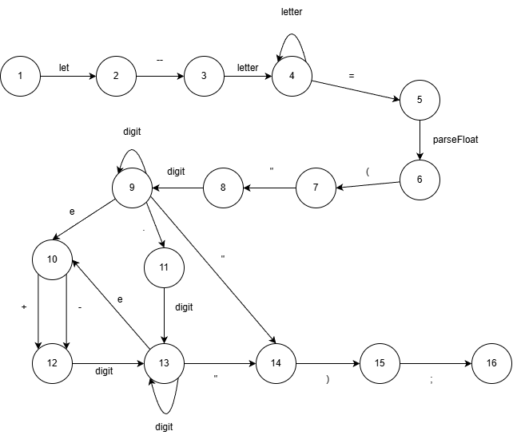

## Диагностика и нейтрализация синтаксических ошибок

Разрабатываемый синтаксический анализатор построен на базе грамматики КС. При нахождении лексемы, которая не соответствует грамматике, предлагается свести алгоритм нейтрализации к последовательному пропуску токенов во входной цепочке до тех пор, пока следующий токен не окажется одним из синхронизирующих токенов, допустимых для возобновления разбора.

## Дополнительное задание

### Грамматика в формате ANTLR

```
grammar ScientificNotationCompact;

options
{
    language = CSharp;
}

// Правила парсера
program : declaration EOF;

declaration : 'let' assignment;

assignment : IDENTIFIER '=' functionCall;

functionCall : 'parseFloat' '(' stringArg ')' ';';

stringArg : '"' number '"' | '\'' number '\'';

number : decimal | scientific;

decimal : DIGITS '.' DIGITS;

scientific : (decimal | DIGITS) ('e' | 'E') sign DIGITS;

sign : ('+' | '-')?;

// Правила лексера
IDENTIFIER : [a-zA-Z] ([a-zA-Z] | [0-9])*;
DIGITS : [0-9]+;

// Пропускаем пробелы
WS : [ \t\r\n]+ -> skip;
```

###  Генерация кода с помощью ANTLR

1. Создание bat-файла для генерации

```
@echo off
set ANTLR_JAR=antlr-4.13.1-complete.jar
set GRAMMAR_FILE=ScientifiNotation.g4
set OUTPUT_FOLDER=Generated

java -jar %ANTLR_JAR% -o %OUTPUT_FOLDER% -Dlanguage=CSharp %GRAMMAR_FILE%

echo fin
pause
```

2. Интеграция в проект

```
using Antlr4.Runtime;
using Antlr4.Runtime.Tree;

private void RunAntlrAnalysis(string text)
{
    try
    {
        ICharStream input = CharStreams.fromString(text);
        ScientificNotationLexer lexer = new ScientificNotationLexer(input);
        var lexerErrorListener = new LexerErrorListener();
        lexer.AddErrorListener(lexerErrorListener);
        CommonTokenStream tokens = new CommonTokenStream(lexer);
        ScientificNotationParser parser = new ScientificNotationParser(tokens);
        parser.RemoveErrorListeners();
        var parserErrorListener = new ParserErrorListener();
        parser.AddErrorListener(parserErrorListener);
        var tree = parser.program();
        if (lexerErrorListener.Errors.Count == 0 && parserErrorListener.Errors.Count == 0)
        {
            outputTextBox.AppendText("ANTLR: Синтаксический анализ успешно завершен\n");
            outputTextBox.AppendText($"Дерево разбора: {tree.ToStringTree(parser)}\n");
        }
        else
        {
            outputTextBox.AppendText($"ANTLR: Обнаружено ошибок: {lexerErrorListener.Errors.Count + parserErrorListener.Errors.Count}\n");
            foreach (var error in lexerErrorListener.Errors)
                outputTextBox.AppendText($"Лексическая ошибка: {error}\n");
            foreach (var error in parserErrorListener.Errors)
                outputTextBox.AppendText($"Синтаксическая ошибка: {error}\n");
        }
    }
    catch (Exception ex)
    {
        outputTextBox.AppendText($"Критическая ошибка ANTLR: {ex.Message}\n");
    }
}


public class LexerErrorListener : IAntlrErrorListener<int>
{
    public List<string> Errors { get; } = new List<string>();
    
    public void SyntaxError(IRecognizer recognizer, int offendingSymbol, int line, 
                            int charPositionInLine, string msg, RecognitionException e)
    {
        Errors.Add($"Строка {line}, позиция {charPositionInLine}: {msg}");
    }
}

public class ParserErrorListener : IAntlrErrorListener<IToken>
{
    public List<string> Errors { get; } = new List<string>();
    
    public void SyntaxError(IRecognizer recognizer, IToken offendingSymbol, int line,
                            int charPositionInLine, string msg, RecognitionException e)
    {
        Errors.Add($"Строка {line}, позиция {charPositionInLine}: {msg}");
    }
}
```

### Вывод

Грамматика, переписанная в формате ANTLR, позволяет автоматически генерировать лексер и парсер на C#. Это значительно упрощает разработку и поддержку синтаксического анализатора, так как ANTLR самостоятельно строит дерево разбора и обрабатывает многие аспекты синтаксического анализа, включая нейтрализацию ошибок.

## Пример работы программы

### Правильно записанное выражение
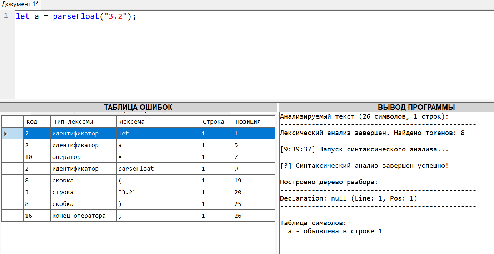


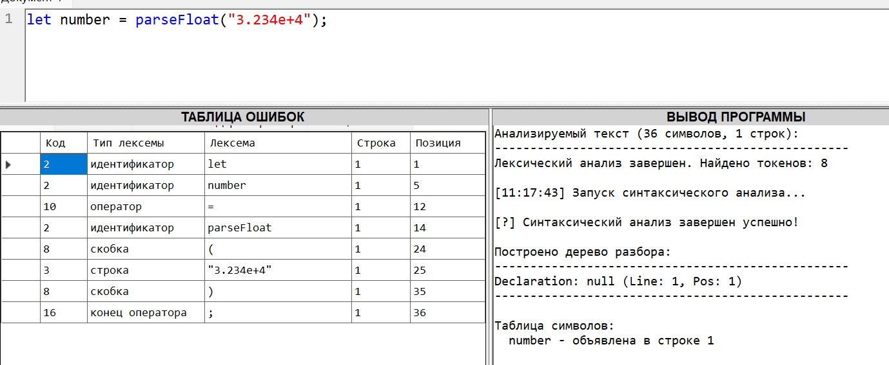


### Допущена одна ошибка

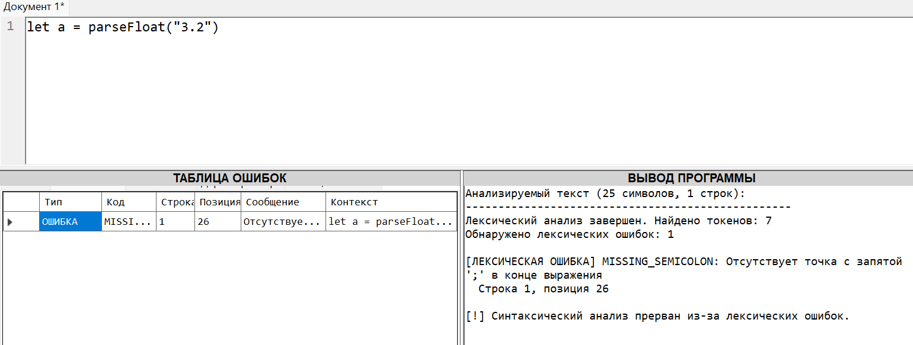


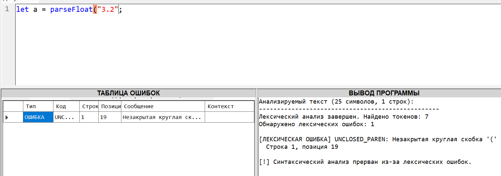


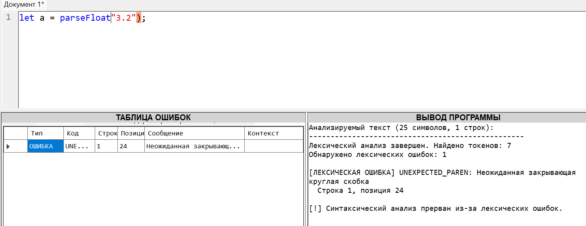


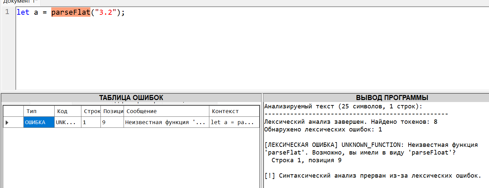


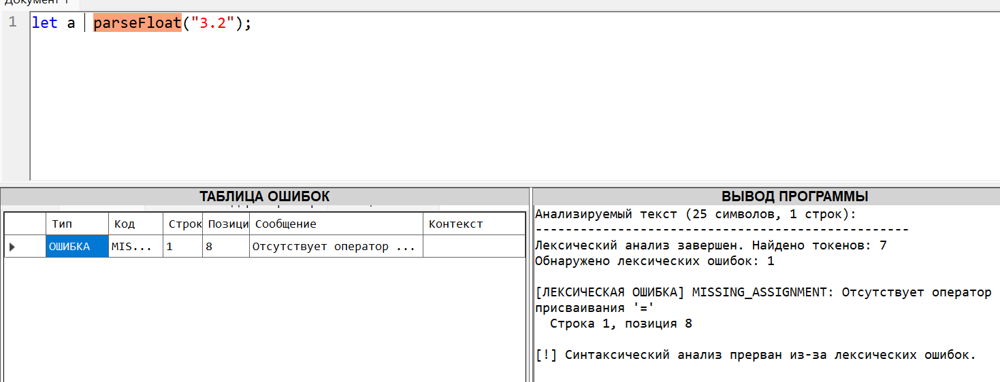


### Допущено две ошибки

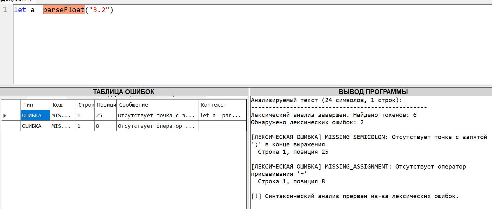


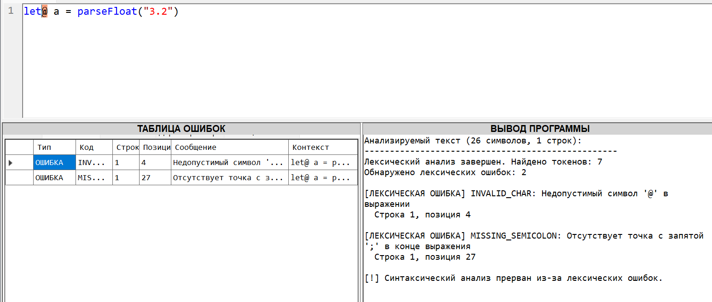

### Допущено три ощибки и более

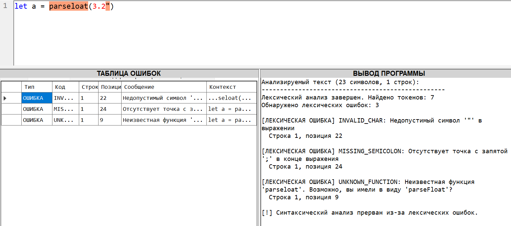


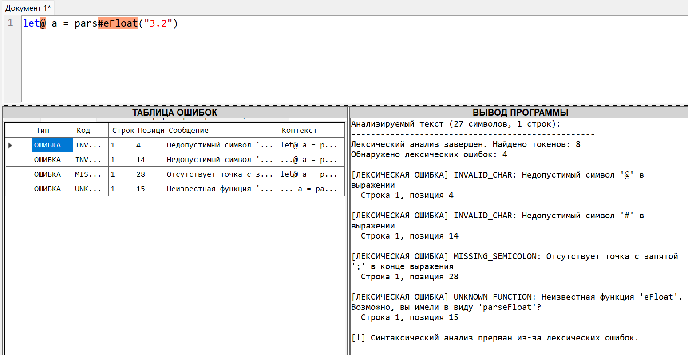
